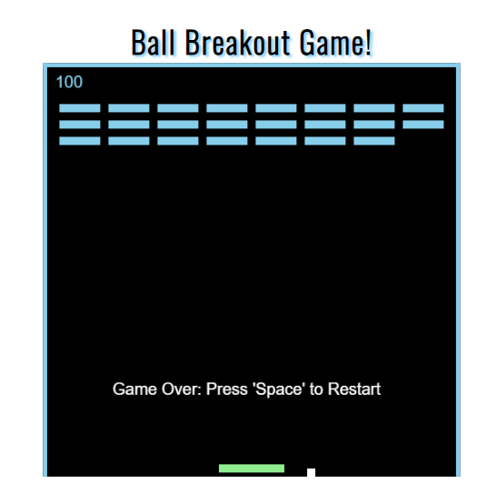

# My Website

## I made this website for pimping myself out.

## This website will contain information about me.

## Features 

This project have everything you need to see my current cv, personal letter, a game and general information about me.

### Existing Features

- __Cleand logo and easy navigation bar__

  - Nice clean logo and navigation bar.

- __Ball Breaker Game__

  - Break bricks and get score, see how high you can get!

### Features Left to Implement

- Whatever i think it nessecery.

## Testing 

It is tested thrue validators and on chrome.

### Validator Testing 

- HTML
    - No errors were returned when passing through the official [W3C validator][(https://validator.w3.org/nu/?doc=https%3A%2F%2Fcode-institute-org.github.io%2Flove-maths%2F)](https://validator.w3.org/nu/?doc=https%3A%2F%2Fdanielerikssonb.se%2F)
- CSS
    - No errors were found when passing through the official [(Jigsaw) validator](https://jigsaw.w3.org/css-validator/validator?uri=https%3A%2F%2Fdanielerikssonb.se%2F&profile=css3svg&usermedium=all&warning=1&vextwarning=&lang=sv)
      <a href="https://jigsaw.w3.org/css-validator/check/referer">
        
- JavaScript Script 1
    - No errors were found when passing through the official [Jshint validator](https://jshint.com/)
      - The following metrics were returned: 
      -There is only one function in this file.
      -It takes no arguments.
      -This function contains 4 statements.
      -Cyclomatic complexity number for this function is 2.

- JavaScript Script 2
    - No errors were found when passing through the official [Jshint validator](https://jshint.com/)
      - The following metrics were returned:
      - There are 11 functions in this file.
      -Function with the largest signature take 2 arguments, while the median is 1.
      -Largest function has 39 statements in it, while the median is 1.
      -The most complex function has a cyclomatic complexity value of 17 while the median is 2.

- Lighthouse on chrome

  [Lighthouse](assets/images/lightde.png)

### Unfixed Bugs

Lots of warnings for old ES browsers.

## Deployment

I bought a webb hotel and hosted it. 

- The site was deployed to a webserver. The steps to deploy are as follows: 
  - Upload it with a FTP program. 

The live link can be found here - https://danielerikssonb.se

## Credits 

I want to thank my friends for making my ball game come true! Bless you Michael and Alex.

### Content 

- Content came from me.

### Media

- The photo used is on me by me.

